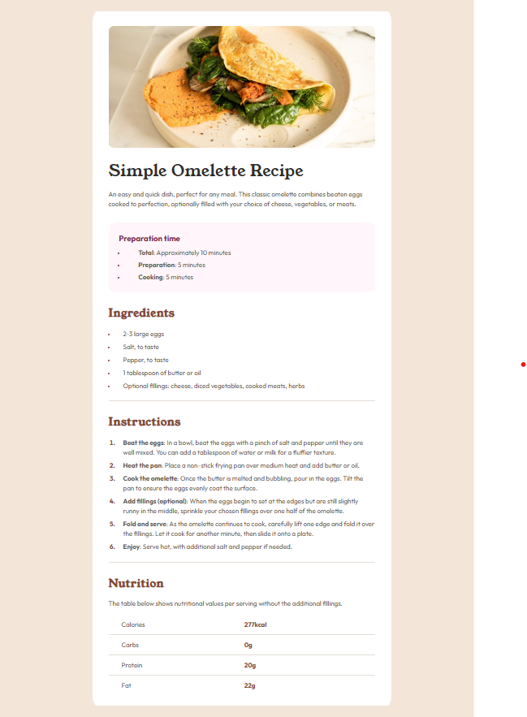

# Frontend Mentor - Recipe page solution

This is a solution to the [Recipe page challenge on Frontend Mentor](https://www.frontendmentor.io/challenges/recipe-page-KiTsR8QQKm). Frontend Mentor challenges help you improve your coding skills by building realistic projects.

## Overview

### Recipe Page

### Links

- Solution URL: [https://github.com/Sonu-Dutta/Frontendmentor-Recipe-Page](https://github.com/Sonu-Dutta/Frontendmentor-Recipe-Page)
- Live Site URL: [https://sonudutta-recipe-page.vercel.app/](https://sonudutta-recipe-page.vercel.app/)

## My process

### Built with

- Semantic HTML5 markup
- CSS custom properties
- Flexbox

### What I learned

I learned about `::marker` pseudo-element, which is very usefull when working with lists.

## Author

- Frontend Mentor - [@sonudutta](https://www.frontendmentor.io/solutions/recipe-page-ukwtue40RS)
